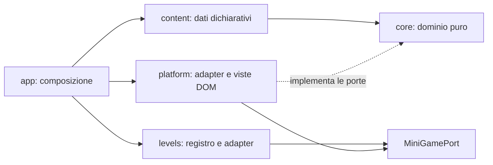

# Architettura

## Decisione sintetica

Il gioco usa **TypeScript vanilla + Vite, senza framework UI e senza game framework**: zero dipendenze runtime.

Il prodotto è un platformer con una storia intorno. Il livello vive su un canvas 2D con fisica pura; tutto il resto — menù, dialoghi, scelte, finale — resta nel DOM, che offre già controlli accessibili, focus, testo adattivo e test semplici.

Phaser o un altro framework 2D diventano sensati soltanto se vengono approvati più mini-giochi con loop continuo, collisioni, tilemap o camera che l'implementazione locale non regge. La procedura è definita in `DECISIONS.md`. Dieci livelli costruiti con un solo adapter e un modello puro sono la prova che, per questo gioco, non serviva.

## Obiettivi architetturali

- Dominio completamente testabile senza browser.
- UI accessibile e indipendente dagli asset.
- Contenuti dichiarativi, verificabili in fase di build.
- Una sola macchina a stati e nessuna mutazione globale.
- Side effect isolati dietro porte piccole.
- Dipendenze runtime iniziali pari a zero.
- Possibilità di aggiungere un mini-gioco senza migrare l'intera applicazione.
- Possibilità di aggiungere capitoli come dati, senza modificare reducer o renderer.

## Struttura del repository

```text
src/
  main.ts
  app/
    bootstrap.ts          composition root
    controller.ts         stato, effetti, render
    config.ts
  core/                   dominio puro, nessun DOM
    model.ts              nodi, condizioni, effetti, alias nominali
    game-state.ts         GameState, RunState, impostazioni
    actions.ts            GameAction e GameEffect
    reducer.ts
    conditions.ts
    save.ts               codifica, decodifica e migrazioni
    ports.ts
  content/
    chain-chapters.ts     collega i capitoli in ordine (ADR-034)
    story-pack.ts         contratti Chapter/ChapterBundle/StoryPack
    dossier.ts            carte e riferimenti alle fonti
    level-position.ts     «Liv. N/10» derivato dal grafo
    validate-content.ts
    locales/it.ts
    packs/core/
      pack.ts
      ui-messages.ts
      chapters/           c00…c09 più c99-finale, ognuno {chapter,messages}.ts
  levels/
    contract.ts           MiniGamePort, MiniGameHandle, LevelOutcome
    define-level.ts       fisica condivisa ed etichette dei controlli
    platformer-model.ts   modello fisico puro
    registry.ts           i dieci livelli e i loro config
    adapters/platformer.ts  canvas, input, HUD, card di fine livello
  platform/
    dom/                  render-app, render-game, share-card, score-card, meme-card
    storage/              local-save, best-score, level-records
    analytics/            noop-analytics, goatcounter-analytics
    audio/chiptune-audio.ts
    pwa/                  sw-template (generato in build), sw-update
  assets/
    manifest.ts
    scenes/ sprites/
  styles/
    tokens.css base.css layout.css

tests/
  content/                validazione del pack come gate di build
  unit/                   dominio, modelli di livello, adapter, storage
  e2e/                    Playwright su tre viewport, con axe
  helpers/ types/

scripts/
  check-bundle-size.mjs   il gate di peso (ADR-052)
  generate-icons.mjs

public/
  icons/ manifest.webmanifest privacy.html termini.html

docs/
```

Evitare cartelle generiche `utils`, `helpers`, `common` o `services`. Un modulo condiviso deve avere un nome legato al suo scopo.

Non esiste un layer `features/`: le viste sono funzioni in `platform/dom/`, che il controller compone. Non esiste una cartella per ruolo, capitolo o schermata; la struttura segue la direzione delle dipendenze, non la mappa dell'interfaccia.

## Direzione delle dipendenze



Regole applicate dalla review e, dove possibile, da lint:

- `core` non importa da nessun altro layer applicativo.
- `content` può importare soltanto tipi da `core`.
- `platform` implementa le porte di `core` e contiene le viste DOM.
- `levels` dipende dal contratto, non dal dominio narrativo: non conosce nodi, capitoli né esiti.
- `app/bootstrap.ts` è il composition root.

## Il pack narrativo compilato

La campagna è un `StoryPack` compilato insieme al gioco, con i capitoli importati esplicitamente da `packs/core/pack.ts`. Non esistono discovery automatica, download runtime, script remoti o API plugin.

Oggi il pack pubblicato è uno solo, `core`, con undici capitoli (dieci con livello più il finale). `chainChapters()` li collega in ordine: ogni capitolo punta in avanti al segnaposto `nextChapterNodeId`, mai al nome del successore, quindi inserire un capitolo a metà campagna **non tocca quelli già scritti** (ADR-034). È il meccanismo che ha retto tre inserimenti consecutivi nella lunga notte dei Sei Colli.

```ts
export interface StoryPack {
  readonly id: StoryPackId;
  readonly version: number;
  readonly kind: "core" | "mystery" | "expansion";
  readonly titleKey: MessageKey;
  readonly descriptionKey: MessageKey;
  readonly estimatedMinutes: number;
  readonly requires: readonly StoryPackId[];
  readonly chapters: readonly ChapterBundle[];
  readonly mysteries: readonly MysteryDefinition[];
  readonly theories: readonly TheoryDefinition[];
}
```

`ChapterInsertion` e `CoreChapterTransition` esistono nei contratti di tipo come cucitura per un eventuale pack opzionale, ma **non c'è una funzione di composizione**: `composeStoryPacks()` non è implementata, perché con un pack solo non ci sarebbe niente da comporre. Se un giorno un secondo pack venisse costruito, le regole che dovrebbe rispettare sono già scritte:

- usa ID prefissati con il proprio ID;
- non sovrascrive nodi, messaggi, fonti o asset core;
- entra ed esce soltanto attraverso extension point dichiarati;
- non contiene callback o codice eseguibile nei dati;
- non modifica punteggi, condizione o destino posseduti dal core;
- può essere saltato e deve tornare al percorso core;
- non rende irraggiungibili finali già validi.

Le regole di authoring di un capitolo o di un livello sono in `EXPANSIONS.md`.

## Macchina a stati

```ts
export type AppPhase = "title" | "playing" | "ending";

export type Role = "hunter" | "guardian" | "mayor" | "varano";
export type StoryScope = "core" | "origins" | "all-registered";
export type VaranoFate =
  "unresolved" | "rescued" | "escaped" | "foundDead" | "killedByHunter";

export interface SetupDraft {
  readonly role?: Role;
  readonly storyScope?: StoryScope;
}

export interface CompletedSetup {
  readonly role: Role;
  readonly storyScope: StoryScope;
}

export interface AccessibilitySettings {
  readonly playMode: "standard" | "story" | "calm";
  readonly textScale: "small" | "medium" | "large";
  readonly highContrast: boolean;
  readonly musicEnabled: boolean;
  readonly effectsEnabled: boolean;
}

export interface GameState {
  readonly phase: AppPhase;
  readonly setup: SetupDraft;
  readonly run?: RunState;
  readonly settings: AccessibilitySettings;
}

export interface RunState {
  readonly currentNodeId: NodeId;
  readonly checkpointNodeId: NodeId;
  readonly coreCheckpointNodeId: NodeId;
  readonly evidence: number;
  readonly care: number;
  readonly publicTrust: number;
  readonly condition: "unknown" | "healthy" | "weak" | "critical";
  readonly seals: readonly SealId[];
  readonly inventory: readonly ItemId[];
  readonly flags: Readonly<Record<FlagId, boolean>>;
  readonly dossierCardIdsSeen: readonly DossierCardId[];
  readonly discoveredClueIds: readonly ClueId[];
  readonly completedPackIds: readonly StoryPackId[];
  readonly varanoFate: VaranoFate;
  readonly selectedTheoryByMystery: Readonly<
    Partial<Record<MysteryId, TheoryId>>
  >;
  readonly visitedNodeIds: readonly NodeId[];
  readonly choices: Readonly<Record<ChoiceId, OptionId>>;
  readonly outcomeId?: OutcomeId;
}
```

Gli alias nominali (`NodeId`, `ClueId`, `TheoryId`, `FlagId`, `LevelId` e gli altri) sono definiti una sola volta nel dominio, come elencato in `CONTENT_MODEL.md`.

**Un solo asse di setup.** Il giocatore sceglie il ruolo, e basta. `approach` e `sensitivity` sono stati rimossi da modello, condizioni, reducer e salvataggio con ADR-048: erano fissi da sempre e gonfiavano la matrice di test senza che il giocatore vedesse nulla. `storyScope` resta nel modello ma vale sempre `"core"`: il renderer degrada esplicitamente gli altri due valori, ed è l'unica cucitura conservata dopo la chiusura della campagna. `dialectEnabled` e `reducedMotion` sono usciti dalle impostazioni con ADR-053: il primo implicava un catalogo di contenuti mai scritto, il secondo è tornato a essere un segnale di sistema che non instrada più fuori dall'arcade (ADR-046).

Durante il setup le selezioni sono parziali in `SetupDraft`. `RUN_STARTED` è accettata soltanto dopo che un type guard puro ha prodotto `CompletedSetup`; il controller non completa valori mancanti in modo implicito. Non esistono fasi `boot`, `disclaimer`, `setup` o `credits`: il gioco parte subito (ADR-021), quindi `title` è una fase di transito e i credits sono una sezione del menù.

Il reducer ha firma pura:

```ts
export function reduce(
  state: GameState,
  action: GameAction,
  story: StoryGraph,
): TransitionResult;

export interface TransitionResult {
  readonly state: GameState;
  readonly effects: readonly GameEffect[];
}
```

Eventi non validi nella fase corrente non modificano lo stato e producono un errore di dominio osservabile in sviluppo, non un crash in produzione.

## Azioni principali

L'elenco completo vive in `src/core/actions.ts`:

```text
ROLE_SELECTED
STORY_SCOPE_SELECTED
SETTINGS_UPDATED
RUN_STARTED
HOTSPOT_ACTIVATED
DIALOGUE_ADVANCED
SURPRISE_DISMISSED
MINIGAME_COMPLETED
MINIGAME_SKIPPED
DOSSIER_CLOSED
OPTION_CHOSEN
RUN_RESUMED
LOCAL_DATA_CLEARED
```

La conferma di una scelta sensibile non è un'azione separata: `OPTION_CHOSEN` arriva al reducer soltanto dopo che la UI ha risolto il dialogo di conferma dichiarato sull'opzione.

## Side effect

Il dominio non chiama browser o servizi. Può richiedere effetti chiusi:

```ts
export type GameEffect =
  | { readonly type: "save-requested" }
  | { readonly type: "clear-save" }
  | { readonly type: "analytics"; readonly event: "game_start" }
  | { readonly type: "focus"; readonly target: FocusTarget };
```

Il controller esegue gli effetti attraverso adapter. Un errore audio, storage o analytics non deve impedire l'avanzamento.

## Rendering DOM-first

Il livello è un canvas 2D a base logica **320×180**, scalato senza smoothing (`image-rendering: pixelated`). Tutto il resto è DOM: HUD, barra di stato, overlay a scheda per dialogo, scelta e finale, menù in-game, card di fine livello e card di KO.

Gli hotspot delle scene narrative sono veri `<button>` posizionati in percentuale sopra la scena, con in più un elenco testuale equivalente: touch, puntatore, Tab/Invio e screen reader portano allo stesso nodo.

Ogni nodo giocabile espone `narrativeLayer: "legend"` e la UI mantiene visibile «LEGGENDA — ricostruzione inventata». FATTO, TESTIMONIANZA, IPOTESI e SCONFESSATO sono timbri delle schede del Dossier/Archivio, mai una promessa documentaria sulla scena o sui personaggi.

Il layout è a schermo intero e mobile-first, verticale e orizzontale, da 320 CSS pixel in su, con i controlli touch in overlay: non viene mai imposta una rotazione del dispositivo. Quando il menù è aperto lo stage diventa `inert` e il livello è in pausa dichiarata (ADR-050/051), così Tab e screen reader non raggiungono il gioco sotto l'overlay.

## Scelte sensibili

Le opzioni delicate usano un contratto generico, non logica speciale nel componente:

```ts
export interface ChoiceConfirmation {
  readonly titleKey: MessageKey;
  readonly bodyKey: MessageKey;
  readonly confirmKey: MessageKey;
  readonly cancelKey: MessageKey;
  readonly safeInitialFocus: "cancel";
}
```

L'opzione di abbattimento:

- è raggiungibile soltanto dal Cacciatore che ha scelto «Documenta la scena» nel prologo, con `role-is` e `choice-is`; la clausola `sensitivity-is complete` è caduta con l'asse (ADR-048), perché l'edizione **è** quella completa;
- richiede una seconda azione nella finestra di conferma;
- mette il focus iniziale su «Torna indietro»;
- non usa timer, gesto di mira, pressione prolungata o input di precisione;
- produce `varanoFate = "killedByHunter"` e un nodo marcato `impliedAnimalDeath`;
- non emette analytics.

I selector presentano una variante non grafica per ogni contenuto sensibile. La UI non mostra impatto, ferite o corpo e interrompe popup e audio allegro fino al termine dell'epilogo.

Il tag è rappresentato da `sensitivityTags: ["impliedAnimalDeath"]` sia sull'opzione letale sia sul relativo `EndingNode`. Le scene in cui una sorpresa è vietata dichiarano `noSurprise: true`; ogni `SurpriseNode` indica il proprio `hostSceneNodeId`, così il vincolo è verificabile in build.

## Controller e render

Il controller mantiene lo stato corrente, riceve azioni dalla UI, invoca il reducer, esegue effetti e genera un `ViewModel` tramite selector puri.

La UI non legge direttamente `GameState` e non modifica dati. I componenti DOM sono funzioni piccole:

```ts
type ViewFactory<T> = (
  model: T,
  dispatch: (action: GameAction) => void,
) => HTMLElement;
```

Ridisegnare la vista principale a ogni transizione è accettabile, purché il focus venga ripristinato su un elemento sensato. C'è **una sola eccezione, e ha un motivo misurato** (ADR-050/053): un'impostazione di pura presentazione — audio, scala del testo, contrasto — applica il proprio effetto e **salta il render**, perché ricostruire il DOM smonterebbe il livello e farebbe ripartire il giocatore dall'inizio. Ogni nuova eccezione deve giustificarsi in quella lista; le altre ottimizzazioni restano vietate finché un profiling non mostra un problema.

## Localizzazione

Tutto il testo visibile usa `MessageKey`.

- `content/locales/it.ts` è l'unico catalogo, completo e obbligatorio.
- Ogni capitolo porta il proprio `messages.ts`, unito al catalogo di chrome in `pack.ts`.
- Una chiave mancante è un errore di validazione in build, non un fallback silenzioso a runtime.
- Il testo con segnaposto è interpolato dal risolutore, che riceve valori tipizzati.

Non esiste una seconda lingua né un catalogo dialettale: `dialectEnabled` è uscito dalle impostazioni con ADR-053. Non introdurre una libreria i18n; una funzione tipizzata di lookup è sufficiente.

## Asset

Il contenuto usa `AssetId`, non percorsi. `assets/manifest.ts` associa ID a import Vite e metadati. Questo consente di cambiare file e formati senza modificare la storia.

Gli sprite CSS dichiarano frame, dimensioni e durata nei metadati. La modalità movimento ridotto usa il primo frame o un'immagine alternativa.

## Storage

```ts
export interface SavePort {
  load(): Promise<LoadResult>;
  save(value: SaveEnvelope): Promise<void>;
  clear(): Promise<void>;
}

export const saveVersion = 2;

export interface SaveEnvelope {
  readonly version: typeof saveVersion;
  readonly state: GameState;
}

export function encodeSave(state: GameState): SaveEnvelope;
export function decodeSave(value: unknown): GameState | undefined;
```

- Adapter: `localStorage`, fallback in memoria.
- Tre chiavi namespaced, tutte locali: `varano-239.save` (partita e impostazioni), `varano-239.best-score` (record personale) e `varano-239.level-records` (l'archivio della Collezione, ADR-057). «Cancella progressi e preferenze» le azzera tutte e tre.
- Decodifica **tollerante sulle impostazioni** e **severa sul run** (ADR-053): un campo di impostazione mancante o invalido torna al proprio default invece di invalidare tutta la partita; un run malformato resta il caso in cui scartare è giusto. Grazie a questo, aggiungere o togliere una preferenza è retrocompatibile per costruzione — prima cancellava la partita di chiunque stesse giocando.
- Salvataggio a checkpoint, scelta e uscita dalle impostazioni; non a ogni render.
- Un checkpoint aggiorna sia `checkpointNodeId` sia `coreCheckpointNodeId`; la distinzione esiste per un eventuale capitolo opzionale, che oggi non c'è.
- Migrazioni pure e testate: `renamedNodeIds` in `save.ts` mappa gli ID rinominati da un refactor di contenuto, così un run salvato su un ID vecchio riprende invece di finire su «questa parte della storia non è disponibile».
- Dato corrotto: nessun crash, si riparte da una nuova partita.
- Aggiungere un capitolo in coda non richiede migrazione; rinominare o rimuovere un ID di nodo sì, con il suo test.
- Pulsante unico «Cancella progressi e preferenze», che azzera tutte e tre le chiavi.
- Nessun nome, email, posizione, data di salvataggio o ID analitico.

## Analytics

```ts
export type AnalyticsEvent = {
  readonly name:
    | "page_view"
    | "game_start"
    | "level_1_complete"
    | "level_3_complete"
    | "level_6_complete"
    | "level_10_complete"
    | "game_complete"
    | "share_attempt"
    | "replay_start";
};

export interface AnalyticsPort {
  track(event: AnalyticsEvent): void;
}
```

Non usare `track(name: string, payload?: unknown)`: una firma aperta consentirebbe di inviare accidentalmente ruolo, finale o scelte.

- `NoopAnalytics` è il default in dev, test e build senza configurazione esplicita.
- L'adapter consigliato per il lancio è GoatCounter; non invia titoli dinamici, referrer completi, proprietà custom, ruolo, percorso narrativo o impostazioni.
- `page_view` viene emesso dal bootstrap una volta sola; non è una transizione del dominio narrativo.
- `game_start` parte una volta a ogni nuova partita, cioè quando il giocatore sceglie un ruolo nella schermata iniziale; una ripresa dal salvataggio non lo emette. L'adapter GoatCounter usa nome fisso e `no_session: true` per contare anche più nuove partite nella stessa sessione.
- Il controller emette le sole milestone fisse dei livelli 1, 3, 6 e 10 dopo il completamento arcade, mai dopo «Salta il livello»; entrando in qualunque finale emette `game_complete` senza esito.
- I controlli di fine campagna emettono `share_attempt` e `replay_start` al clic, senza contenuto, risultato o altre proprietà.
- DNT/GPC disabilitano l'adapter in modo conservativo.
- Il gioco non dipende dalla rete e ignora gli errori analytics.
- Destino del Varano, ruolo, scelte, punteggio, lingua e impostazioni restano esclusivamente locali.

## Contratto mini-giochi

```ts
export interface MiniGamePort<Config extends object> {
  mount(host: HTMLElement, request: MiniGameRequest<Config>): MiniGameHandle;
}

export interface MiniGameRequest<Config extends object> {
  readonly levelId: LevelId;
  readonly configId: LevelConfigId;
  readonly config: Readonly<Config>;
  readonly role: Role;
  /** «Liv. N/10», derivato dal grafo e mostrato accanto alle vite (ADR-045). */
  readonly position?: { readonly index: number; readonly total: number };
  readonly settings: AccessibilitySettings;
  readonly message: (key: MessageKey, values?: MessageValues) => string;
  readonly audio: LevelAudioPort;
  readonly onComplete: (outcome: LevelOutcome) => void;
  readonly onExit: () => void;
}

export interface MiniGameHandle {
  pause(): void;
  resume(): void;
  /** Ricomincia il tentativo, storia intatta (ADR-051). */
  restart(): void;
  destroy(): void;
}

/** Quanto basta a una card di fine livello, niente di più. */
export interface LevelOutcome {
  readonly score: number;
  readonly clues: number;
  readonly totalClues: number;
  readonly seconds: number;
  readonly respawns: number;
  readonly bonusCollected: boolean;
  readonly cameoSeen: boolean;
}
```

`src/levels/registry.ts` tiene insieme adattatore e configurazioni nella mappa `levelConfigs`. È l'unico modulo che risolve la coppia `levelId`/`configId`; una coppia assente è un errore di contenuto in build e un errore recuperabile al bootstrap. È anche l'unico punto in cui il **ruolo** viene tradotto in un potere: `mountRegisteredLevel()` legge `powersByRole[role]` e passa al modello un solo `power`, così la fisica resta pura e testabile senza ruolo (ADR-031). Il risultato non viene memorizzato come oggetto separato: il reducer sceglie `completedNodeId` o `skippedNodeId` e il normale `RunState` persistito registra il nuovo nodo. DOM, timer, canvas, configurazioni e oggetti di framework non entrano mai nel salvataggio. Ogni mini-gioco deve avere un esito equivalente tramite «Salta sfida».

### I dieci livelli

Dieci `LevelNode` condividono lo stesso adapter platformer e la stessa fisica pura. L'ordine è quello della campagna; i numeri di cartella (`c00`…`c09`) sono l'ordine di produzione, non quello di storia (ADR-045).

| #   | Livello                   | `levelId`                         | Meccanica aggiunta                                                                                                        |
| --- | ------------------------- | --------------------------------- | ------------------------------------------------------------------------------------------------------------------------- |
| 1   | I campi di Montichiari    | `core.level.campi-di-montichiari` | corsa, salto, raccolta, traguardo                                                                                         |
| 2   | Le chat di paese          | `core.level.chat-di-paese`        | `sprint?`, caricato tenendo una direzione (ADR-029)                                                                       |
| 3   | La zona interdetta        | `core.level.zona-interdetta`      | droni con carburante e transenne della zona rossa (ADR-045)                                                               |
| 4   | Tre identità              | `core.level.tre-identita`         | il laboratorio delle versioni, montacarichi e vetrine (ADR-045)                                                           |
| 5   | Acqua e impronte          | `core.level.acqua-e-impronte`     | rogge, zattera come piattaforma mobile, le sei nutrie in costume (ADR-045)                                                |
| 6   | Il borgo delle versioni   | `core.level.borgo-delle-versioni` | tetti e stendibiancheria, cesta su carrucola lungo l'asse y (ADR-045)                                                     |
| 7   | Il colle di San Pancrazio | `core.level.colle-san-pancrazio`  | la salita a terrazze all'alba, l'asse verticale usato davvero (ADR-045)                                                   |
| 8   | Varano superstar          | `core.level.varano-superstar`     | `power?` per ruolo e `obstacles?` non letali (ADR-031, ADR-032)                                                           |
| 9   | Il parco del Castello     | `core.level.parco-del-castello`   | `gapKind: "water"` e `cars?`, il furgoncino di pattuglia (ADR-036/037)                                                    |
| 10  | Dentro il Castello        | `core.level.dentro-il-castello`   | fondale `indoor` con ritorno del cielo, costumi `obstacleLooks`/`carLooks`, suolo `stone`, traguardo `sunstone` (ADR-039) |

Ogni livello ha **3 vite per tentativo** (ADR-041): cadute e veicoli di pattuglia costano una vita; a zero la card KO offre «Riprova il livello» (stato di sessione ricreato da zero) e il consueto «Salta il livello». Dalla ADR-051 «Riprova il livello» è raggiungibile anche dal menù a livello vivo. La storia non perde mai progressi e il grafo narrativo non sa nulla di vite.

Dalle ADR-042/043/044: ogni livello dichiara la propria traccia chiptune (`music?`), può avere piattaforme mobili one-way che trasportano chi ci sta sopra (`movingPlatforms?`, onda triangolare pura come ADR-037), una stella bonus presa solo col superpotere ingaggiato (`bonus?`, +500 punti, mai richiesta) e un cameo deterministico del Varano (`cameo?`, solo presentazione). I dialoghi sono bolle con il nome del parlante (chiave `<pack>.message.speaker.X` derivata dallo `speakerId` e validata in build); gli interludi con micro-scelta hanno effetti sui punteggi, e i tre dei colli assegnano i **sei sigilli** e la **condizione** del Varano, mostrati nella scheda di briefing.

A fine livello compare una **card di esito** (ADR-056) con posizione, punteggio, indizi, vite e fino a tre riconoscimenti; l'avanzamento automatico resta, il pulsante lo anticipa soltanto. Il risultato viene poi archiviato per livello con semantica best-of (ADR-057): un tentativo peggiore non cancella mai quello che il giocatore aveva già ottenuto. Indizi, stella, cameo e vite **non toccano** reputazione, sigilli, condizione o disponibilità dei finali: altrimenti salterebbe l'invariante «Salta il livello produce un esito narrativo identico».

Ogni nodo porta le proprie `headingKey` e `introKey` (ADR-030). `power?` e `obstacles?` sono opzionali come `sprint?`, quindi un livello nuovo non tocca il bilanciamento di quelli esistenti.

Ogni livello dichiara inoltre un `backdrop` obbligatorio (ADR-033) con cielo, ora del giorno e i due strati di parallasse. Vive in `PlatformerViewConfig` perché è presentazione: `PlatformerConfig`, la fisica pura, non conosce colori. `registeredLevels` espone tutti i livelli con la loro configurazione, così le invarianti di design si affermano sull'intero registro invece che su un livello alla volta.

### L'adapter platformer

Un solo adapter serve tutti e dieci i livelli (ADR-018). Usa `requestAnimationFrame` con timestep fisso a 1/120, rendering **canvas 2D** procedurale (base logica 320×180 scalata con `image-rendering: pixelated`) e una funzione fisica pura in TypeScript (`platformer-model.ts`: accelerazione, salto variabile, coyote time, jump buffer, piattaforme one-way, checkpoint con respawn morbido, onde triangolari deterministiche per i mover); non aggiunge dipendenze runtime o un framework.

L'app è a schermo intero senza title screen (ADR-021): il controller avvia o riprende automaticamente la partita dalla fase transitoria `title`. HUD, barra narrativa, overlay a scheda (dialogo, scelta, finale) e menù in-game (impostazioni, Collezione, credits, privacy, termini — con il link all'Archivio dentro i credits) restano nel DOM. L'audio chiptune è generato via WebAudio dietro `GameAudio` (ADR-019) e la musica parte solo dopo il primo input dell'utente; uscendo dalla scheda il loop e lo scheduler audio si fermano insieme (ADR-051).

La posizione istantanea del personaggio e gli input appartengono alla sessione dell'adapter e non entrano nel salvataggio. `GameState` salva il `LevelNode`; una ripresa ricomincia la breve sfida. Il reducer riceve soltanto `MINIGAME_COMPLETED` o `MINIGAME_SKIPPED`, che portano allo stesso nodo narrativo.

Il rendering ha un cricchetto misurato: `tests/unit/render-budget.test.ts` monta i dieci livelli, esegue N frame deterministici e verifica che le chiamate al contesto canvas per frame restino sotto un tetto registrato. È immune al rumore di CI e serve a impedire regressioni silenziose di disegno.

## Gestione errori

- Errori di contenuto fermano build e CI.
- Errori di programmazione falliscono rumorosamente in sviluppo.
- Errori di piattaforma mostrano un messaggio semplice e degradano la funzione interessata.
- Nessun `catch` vuoto.
- I messaggi tecnici non vengono mostrati ai giocatori; console e test conservano il dettaglio.

## Budget

- JavaScript iniziale: obiettivo tetto verificato di 60 KB gzip (`npm run size`, ADR-052), asset esclusi.
- Nessun asset remoto necessario al gioco.
- Caricamento per capitolo soltanto quando gli asset lo giustificano.
- Nessun framework nel chunk iniziale.
- Nessun errore console nei percorsi E2E.
- Animazioni pixel fluide su un telefono mobile rappresentativo; la storia resta utilizzabile anche senza animazioni.
