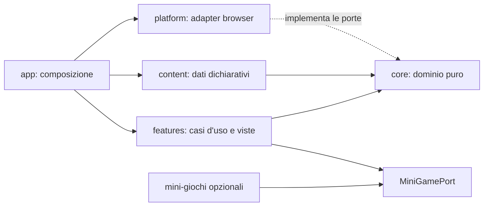

# Architettura

## Decisione sintetica

L'MVP usa **TypeScript vanilla + Vite, senza framework UI e senza game framework**.

Il prodotto è un'avventura a scene: il DOM offre già controlli accessibili, focus, testo adattivo, responsive layout e test semplici. Pixel art, sprite e popup possono essere gestiti con immagini, CSS `steps()` e `image-rendering: pixelated`.

Phaser o un altro framework 2D diventano sensati soltanto se vengono approvati più mini-giochi con loop continuo, collisioni, tilemap o camera. La procedura è definita in `DECISIONS.md`.

## Obiettivi architetturali

- Dominio completamente testabile senza browser.
- UI accessibile e indipendente dagli asset.
- Contenuti dichiarativi, verificabili in fase di build.
- Una sola macchina a stati e nessuna mutazione globale.
- Side effect isolati dietro porte piccole.
- Dipendenze runtime iniziali pari a zero.
- Possibilità di aggiungere un mini-gioco senza migrare l'intera applicazione.
- Possibilità di aggiungere capitoli e misteri come dati, senza modificare reducer o renderer.

## Struttura del repository

```text
src/
  main.ts
  app/
    bootstrap.ts
    controller.ts
    config.ts
  core/
    model.ts
    actions.ts
    reducer.ts
    selectors.ts
    conditions.ts
    outcome.ts
    effects.ts
    ports.ts
  content/
    chain-chapters.ts
    campaign.ts
    compose-packs.ts
    packs/
      core/
        pack.ts
        ui-messages.ts
        chapters/
          c00-first-sighting/
          c01-village-chats/
          c02-superstar/
          c99-finale/
      origins/
        pack.ts
        chapters/
          x01-open-cage/
          x02-unnamed-crate/
          x03-tail-society/
    locales/
      it.ts
      it-bs.ts
    sources.ts
    validate-content.ts
  features/
    disclaimer/
    setup/
    scene/
    dialogue/
    choice/
    archive/
    mystery-board/
    inventory/
    surprise/
    minigame/
    ending/
    settings/
  levels/
    contract.ts
    registry.ts
    adapters/
  platform/
    dom/
      render-app.ts
      focus-manager.ts
    storage/
      local-save.ts
      migrations.ts
    analytics/
      noop-analytics.ts
      goatcounter-analytics.ts
    audio/
      browser-audio.ts
      noop-audio.ts
    random/
      seeded-random.ts
    time/
      browser-clock.ts
  assets/
    manifest.ts
    scenes/
    sprites/
    audio/
  styles/
    tokens.css
    base.css
    layout.css
    pixel-art.css

tests/
  e2e/
  fixtures/

public/
  icons/

docs/
```

Evitare cartelle generiche `utils`, `helpers`, `common` o `services`. Un modulo condiviso deve avere un nome legato al suo scopo.

## Direzione delle dipendenze



Regole applicate dalla review e, dove possibile, da lint:

- `core` non importa da nessun altro layer applicativo.
- `content` può importare soltanto tipi da `core`.
- `features` importa `core`, contenuti tramite interfacce e primitive DOM.
- `platform` implementa porte di `core` o `features`.
- `app/bootstrap.ts` è il composition root.

## Pacchetti narrativi compilati

Un nuovo mistero o capitolo è un `StoryPack` importato esplicitamente da `campaign.ts`. Non esistono discovery automatica, download runtime, script remoti o API plugin.

```ts
export interface StoryPack {
  readonly id: StoryPackId;
  readonly version: number;
  readonly kind: "core" | "mystery" | "expansion";
  readonly titleKey: MessageKey;
  readonly descriptionKey: MessageKey;
  readonly estimatedMinutes: number;
  readonly requires: readonly StoryPackId[];
  readonly chapters: readonly ChapterBundle[];
  readonly mysteries: readonly MysteryDefinition[];
  readonly theories: readonly TheoryDefinition[];
}
```

Ogni `ChapterBundle` opzionale dichiara un unico oggetto `insertion` con hook `at` e priorità `order`; uno stesso pack può distribuire capitoli in più punti della campagna. `CampaignDefinition.coreTransitions` assegna una destinazione a ogni uscita core e pubblica come hook soltanto le transizioni con `extensionPointId`. `composeStoryPacks()` seleziona i pack per nuova partita o snapshot salvato, ordina gli innesti in modo deterministico, verifica namespace, dipendenze e hook e produce una `StoryComposition` con un solo `StoryGraph` immutabile. Un pacchetto:

- usa ID prefissati con il proprio ID;
- non sovrascrive nodi, messaggi, fonti o asset core;
- entra ed esce soltanto attraverso extension point dichiarati;
- non contiene callback o codice eseguibile nei dati;
- non modifica punteggi, condizione o destino posseduti dal core;
- può essere saltato e deve tornare al percorso core;
- non rende irraggiungibili finali già validi.

Le regole di authoring e versionamento sono in `EXPANSIONS.md`.

## Macchina a stati

```ts
export type AppPhase =
  "boot" | "title" | "disclaimer" | "setup" | "playing" | "ending" | "credits";

export type Role = "hunter" | "guardian" | "mayor" | "varano";
export type Approach = "evidence" | "rescue";
export type Sensitivity = "gentle" | "complete";
export type StoryScope = "core" | "origins" | "all-registered";
export type VaranoFate =
  "unresolved" | "rescued" | "escaped" | "foundDead" | "killedByHunter";

export interface SetupDraft {
  readonly role?: Role;
  readonly approach?: Approach;
  readonly sensitivity?: Sensitivity;
  readonly storyScope?: StoryScope;
}

export interface CompletedSetup {
  readonly role: Role;
  readonly approach: Approach;
  readonly sensitivity: Sensitivity;
  readonly storyScope: StoryScope;
}

export interface AccessibilitySettings {
  readonly playMode: "standard" | "story" | "calm";
  readonly textScale: "small" | "medium" | "large";
  readonly highContrast: boolean;
  readonly reducedMotion: boolean;
  readonly musicEnabled: boolean;
  readonly effectsEnabled: boolean;
  readonly dialectEnabled: boolean;
}

export interface GameState {
  readonly phase: AppPhase;
  readonly setup: SetupDraft;
  readonly run?: RunState;
  readonly settings: AccessibilitySettings;
}

export interface RunState {
  readonly currentNodeId: NodeId;
  readonly checkpointNodeId: NodeId;
  readonly coreCheckpointNodeId: NodeId;
  readonly evidence: number;
  readonly care: number;
  readonly publicTrust: number;
  readonly condition: "unknown" | "healthy" | "weak" | "critical";
  readonly seals: readonly SealId[];
  readonly inventory: readonly ItemId[];
  readonly flags: Readonly<Record<FlagId, boolean>>;
  readonly dossierCardIdsSeen: readonly DossierCardId[];
  readonly discoveredClueIds: readonly ClueId[];
  readonly completedPackIds: readonly StoryPackId[];
  readonly varanoFate: VaranoFate;
  readonly selectedTheoryByMystery: Readonly<
    Partial<Record<MysteryId, TheoryId>>
  >;
  readonly visitedNodeIds: readonly NodeId[];
  readonly choices: Readonly<Record<ChoiceId, OptionId>>;
  readonly outcomeId?: OutcomeId;
}
```

Gli alias nominali (`NodeId`, `ClueId`, `TheoryId`, `FlagId`, `LevelId` e gli altri) sono definiti una sola volta nel dominio, come elencato in `CONTENT_MODEL.md`. Le tre teorie iniziali appartengono al pack `origins`; il core può quindi accogliere misteri futuri senza cambiare union o reducer.

Durante il setup le selezioni sono parziali in `SetupDraft`. `RUN_STARTED` è accettata soltanto dopo che un type guard puro ha prodotto `CompletedSetup`; il controller non completa valori mancanti in modo implicito.

Il reducer ha firma pura:

```ts
export function reduce(
  state: GameState,
  action: GameAction,
  story: StoryGraph,
): TransitionResult;

export interface TransitionResult {
  readonly state: GameState;
  readonly effects: readonly GameEffect[];
}
```

Eventi non validi nella fase corrente non modificano lo stato e producono un errore di dominio osservabile in sviluppo, non un crash in produzione.

## Azioni principali

```text
BOOT_COMPLETED
NEW_GAME_REQUESTED
DISCLAIMER_CONFIRMED
SENSITIVITY_SELECTED
ROLE_SELECTED
APPROACH_SELECTED
STORY_SCOPE_SELECTED
RUN_STARTED
HOTSPOT_ACTIVATED
DIALOGUE_ADVANCED
OPTION_CHOSEN
SENSITIVE_OPTION_CONFIRMED
THEORY_SELECTED
OPTIONAL_PACK_SKIPPED
SURPRISE_DISMISSED
MINIGAME_COMPLETED
MINIGAME_SKIPPED
SETTINGS_UPDATED
ARCHIVE_OPENED
RUN_RESUMED
LOCAL_DATA_CLEARED
```

## Side effect

Il dominio non chiama browser o servizi. Può richiedere effetti chiusi:

```ts
export type GameEffect =
  | { readonly type: "save-requested" }
  | { readonly type: "play-audio"; readonly cueId: string }
  | { readonly type: "analytics"; readonly event: "game_start" }
  | { readonly type: "focus"; readonly target: FocusTarget };
```

Il controller esegue gli effetti attraverso adapter. Un errore audio, storage o analytics non deve impedire l'avanzamento.

## Rendering DOM-first

La scena usa una base logica 320×180 o 384×216, scelta una sola volta nel vertical slice. L'immagine viene scalata con fattori interi quando possibile e senza smoothing.

Gli hotspot sono veri `<button>` posizionati in percentuale sopra la scena. Ogni scena offre anche un elenco testuale equivalente sotto l'immagine. Il giocatore può quindi usare touch, puntatore, Tab/Invio o screen reader.

Ogni nodo giocabile espone `narrativeLayer: "legend"` e la UI mantiene visibile «LEGGENDA — ricostruzione inventata». FATTO, TESTIMONIANZA, IPOTESI e SCONFESSATO sono timbri delle schede del Dossier/Archivio, mai una promessa documentaria sulla scena o sui personaggi.

In verticale:

1. scena;
2. obiettivo;
3. dialogo/scelte;
4. inventario e archivio collassabili.

Su desktop, scena e pannello narrativo possono essere affiancati. Non imporre una rotazione del dispositivo.

## Scelte sensibili

Le opzioni delicate usano un contratto generico, non logica speciale nel componente:

```ts
export interface ChoiceConfirmation {
  readonly titleKey: MessageKey;
  readonly bodyKey: MessageKey;
  readonly confirmKey: MessageKey;
  readonly cancelKey: MessageKey;
  readonly safeInitialFocus: "cancel";
}
```

L'opzione di abbattimento:

- è assente in `gentle`;
- è raggiungibile soltanto a `hunter + evidence + complete`;
- richiede una seconda azione nella finestra di conferma;
- mette il focus iniziale su «Torna indietro»;
- non usa timer, gesto di mira, pressione prolungata o input di precisione;
- produce `varanoFate = "killedByHunter"` e un nodo marcato `impliedAnimalDeath`;
- non emette analytics.

I selector presentano una variante non grafica per ogni contenuto sensibile. La UI non mostra impatto, ferite o corpo e interrompe popup e audio allegro fino al termine dell'epilogo.

Il tag è rappresentato da `sensitivityTags: ["impliedAnimalDeath"]` sia sull'opzione letale sia sul relativo `EndingNode`. Le scene in cui una sorpresa è vietata dichiarano `noSurprise: true`; ogni `SurpriseNode` indica il proprio `hostSceneNodeId`, così il vincolo è verificabile in build.

## Controller e render

Il controller mantiene lo stato corrente, riceve azioni dalla UI, invoca il reducer, esegue effetti e genera un `ViewModel` tramite selector puri.

La UI non legge direttamente `GameState` e non modifica dati. I componenti DOM sono funzioni piccole:

```ts
type ViewFactory<T> = (
  model: T,
  dispatch: (action: GameAction) => void,
) => HTMLElement;
```

Per l'MVP è accettabile ridisegnare la vista principale a ogni transizione, purché `focus-manager` ripristini un focus sensato. Ottimizzazioni incrementali sono vietate finché un profiling non mostra un problema.

## Localizzazione

Tutto il testo visibile usa `MessageKey`.

- `it.ts` è completo e obbligatorio.
- `it-bs.ts` contiene soltanto battute facoltative.
- Risoluzione: dialetto → italiano → errore di validazione in build.
- Il dialetto non modifica condizioni o informazioni necessarie.

Non introdurre una libreria i18n nell'MVP. Una funzione tipizzata di lookup è sufficiente.

## Asset

Il contenuto usa `AssetId`, non percorsi. `assets/manifest.ts` associa ID a import Vite e metadati. Questo consente di cambiare file e formati senza modificare la storia.

Gli sprite CSS dichiarano frame, dimensioni e durata nei metadati. La modalità movimento ridotto usa il primo frame o un'immagine alternativa.

## Storage

```ts
export interface SavePort {
  load(): Promise<LoadResult>;
  save(value: SaveEnvelope): Promise<void>;
  clear(): Promise<void>;
}

export type LoadResult =
  | { readonly status: "empty" }
  | { readonly status: "loaded"; readonly value: SaveEnvelope }
  | { readonly status: "invalid"; readonly reason: string };

export interface SaveEnvelope {
  readonly schemaVersion: number;
  readonly contentVersion: number;
  readonly activePackVersions: Readonly<Record<StoryPackId, number>>;
  readonly savedAt: string;
  readonly state: PersistedState;
}

export interface PersistedState {
  readonly setup: SetupDraft;
  readonly run?: PersistedRun;
  readonly settings: AccessibilitySettings;
}

export type PersistedRun = RunState;
```

- Adapter MVP: `localStorage`, fallback in memoria.
- Chiave namespaced: `varano-239:save:v1`.
- Salvataggio a checkpoint, scelta e uscita dalle impostazioni; non a ogni render.
- Un checkpoint del core aggiorna sia `checkpointNodeId` sia `coreCheckpointNodeId`; un checkpoint opzionale aggiorna soltanto `checkpointNodeId`.
- Migrazioni pure e testate.
- Dato corrotto: avviso non bloccante e nuova partita.
- Nodo rimosso: ritorno al checkpoint compatibile.
- Pacchetto nuovo in coda: nessuna migrazione; ID rinominati o rimossi richiedono una migrazione esplicita.
- `activePackVersions` fotografa i pack scelti all'avvio: un pack aggiunto alla build non entra a metà di una partita esistente.
- Una nuova partita compone con `{ kind: "new-run", scope }`; una ripresa compone con `{ kind: "resume", activePackVersions }`. Il secondo percorso include soltanto lo snapshot salvato e segnala pack assenti o versioni da migrare prima del render.
- Pacchetto assente al caricamento: prima si imposta `currentNodeId` e `checkpointNodeId` sul `coreCheckpointNodeId`; poi si eliminano tutti i riferimenti col namespace assente da `dossierCardIdsSeen`, `discoveredClueIds`, `inventory`, `seals`, `completedPackIds`, `visitedNodeIds`, chiavi e valori di `choices`, chiavi e valori di `selectedTheoryByMystery`, `flags` e l'eventuale `outcomeId`. Si rimuove anche il pack da `activePackVersions`. Restano soltanto ID core e flag `campaign.*` ancora presenti in `sharedFlagIds`; infine si mostra un avviso non bloccante e si risalva. Il validatore vieta ai pack opzionali di modificare punteggi, condizione o destino core, quindi la bonifica non deve ricostruire effetti anonimi.
- Pulsante unico «Cancella progressi e preferenze».
- Nessun nome, email, posizione o ID analitico.

## Analytics

```ts
export type AnalyticsEvent =
  { readonly name: "page_view" } | { readonly name: "game_start" };

export interface AnalyticsPort {
  track(event: AnalyticsEvent): void;
}
```

Non usare `track(name: string, payload?: unknown)`: una firma aperta consentirebbe di inviare accidentalmente ruolo, finale o scelte.

- `NoopAnalytics` è il default in dev, test e build senza configurazione esplicita.
- L'adapter consigliato per il lancio è GoatCounter; non invia titoli dinamici, referrer completi, proprietà custom, ruolo, percorso narrativo o impostazioni.
- `page_view` viene emesso dal bootstrap una volta sola; non è una transizione del dominio narrativo.
- `game_start` parte una volta dopo ogni comando esplicito «Inizia»; l'adapter GoatCounter usa nome fisso e `no_session: true` per contare anche più nuove partite nella stessa sessione.
- DNT/GPC disabilitano l'adapter in modo conservativo.
- Il gioco non dipende dalla rete e ignora gli errori analytics.
- Destino del Varano, teoria scelta, pacchetti completati e scelta letale restano esclusivamente locali.

## Contratto mini-giochi

```ts
export interface MiniGamePort<Config extends object> {
  mount(host: HTMLElement, request: MiniGameRequest<Config>): MiniGameHandle;
}

export interface MiniGameRequest<Config extends object> {
  readonly levelId: LevelId;
  readonly configId: LevelConfigId;
  readonly config: Readonly<Config>;
  readonly role: Role;
  readonly seed: number;
  readonly settings: AccessibilitySettings;
  readonly onComplete: (result: MiniGameResult) => void;
  readonly onExit: () => void;
}

export interface MiniGameHandle {
  pause(): void;
  resume(): void;
  destroy(): void;
}

export type MiniGameResult =
  { readonly status: "completed" } | { readonly status: "skipped" };

export interface LevelRegistration<Config extends object> {
  readonly levelId: LevelId;
  readonly configs: Readonly<Record<LevelConfigId, Readonly<Config>>>;
  readonly adapter: MiniGamePort<Config>;
}
```

`src/levels/registry.ts` tiene insieme adattatore e configurazioni nella mappa `levelConfigs`. È l'unico modulo che risolve la coppia `levelId`/`configId`; una coppia assente è un errore di contenuto in build e un errore recuperabile al bootstrap. È anche l'unico punto in cui il **ruolo** viene tradotto in un potere: `mountRegisteredLevel()` legge `powersByRole[role]` e passa al modello un solo `power`, così la fisica resta pura e testabile senza ruolo (ADR-031). Il risultato non viene memorizzato come oggetto separato: il reducer sceglie `completedNodeId` o `skippedNodeId` e il normale `RunState` persistito registra il nuovo nodo. DOM, timer, canvas, configurazioni e oggetti di framework non entrano mai nel salvataggio. Ogni mini-gioco deve avere un esito equivalente tramite «Salta sfida».

### Livelli attuali

Cinque `LevelNode` condividono lo stesso adapter platformer e la stessa fisica pura:

| Livello                    | `levelId`                         | Meccanica aggiunta                                                                                                        |
| -------------------------- | --------------------------------- | ------------------------------------------------------------------------------------------------------------------------- |
| 1 — I campi di Montichiari | `core.level.campi-di-montichiari` | corsa, salto, raccolta, traguardo                                                                                         |
| 2 — Le chat di paese       | `core.level.chat-di-paese`        | `sprint?`, caricato tenendo una direzione (ADR-029)                                                                       |
| 3 — Varano superstar       | `core.level.varano-superstar`     | `power?` per ruolo e `obstacles?` non letali (ADR-031, ADR-032)                                                           |
| 4 — Il parco del Castello  | `core.level.parco-del-castello`   | `gapKind: "water"` e `cars?`, il furgoncino di pattuglia (ADR-036/037)                                                    |
| 5 — Dentro il Castello     | `core.level.dentro-il-castello`   | fondale `indoor` con ritorno del cielo, costumi `obstacleLooks`/`carLooks`, suolo `stone`, traguardo `sunstone` (ADR-039) |

Ogni livello ha **3 vite per tentativo** (ADR-041): cadute e veicoli di pattuglia costano una vita; a zero la card KO offre «Riprova il livello» (stato di sessione ricreato da zero) e il consueto «Salta il livello». La storia non perde mai progressi e il grafo narrativo non sa nulla di vite.

Dalle ADR-042/043/044: ogni livello dichiara la propria traccia chiptune (`music?`), può avere piattaforme mobili one-way che trasportano chi ci sta sopra (`movingPlatforms?`, onda triangolare pura come ADR-037), una stella bonus presa solo col superpotere ingaggiato (`bonus?`, +500 punti, mai richiesta) e un cameo deterministico del Varano (`cameo?`, solo presentazione). I dialoghi sono bolle con il nome del parlante (chiave `<pack>.message.speaker.X` derivata dallo `speakerId` e validata in build) e i capitoli 1-3 hanno una micro-scelta d'interludio con effetti sui punteggi, mostrati nella scheda di briefing.

Ogni nodo porta le proprie `headingKey` e `introKey` (ADR-030). `power?` e `obstacles?` sono opzionali come `sprint?`, quindi un livello nuovo non tocca il bilanciamento di quelli esistenti.

Ogni livello dichiara inoltre un `backdrop` obbligatorio (ADR-033) con cielo, ora del giorno e i due strati di parallasse. Vive in `PlatformerViewConfig` perché è presentazione: `PlatformerConfig`, la fisica pura, non conosce colori. `registeredLevels` espone tutti i livelli con la loro configurazione, così le invarianti di design si affermano sull'intero registro invece che su un livello alla volta.

### Implementazione M1P

`core.level.campi-di-borgocoda` è l'adapter platformer del loop principale (ADR-018). Usa `requestAnimationFrame` con timestep fisso, rendering **canvas 2D** procedurale (base logica 320×180 scalata con `image-rendering: pixelated`) e una funzione fisica pura in TypeScript (`platformer-model.ts`: accelerazione, salto variabile, coyote time, jump buffer, piattaforme one-way, checkpoint con respawn morbido); non aggiunge dipendenze runtime o un framework. Il registro risolve la sola coppia `core.level.campi-di-borgocoda` / `core.level-config.campi-1` e il validatore ne controlla l'esistenza e le chiavi di messaggio.

L'app è a schermo intero senza title screen (ADR-021): il controller avvia o riprende automaticamente la partita dalla fase transitoria `title`. HUD, barra narrativa, overlay a scheda (dialogo, Dossier, scelta, finale) e menù in-game (impostazioni, Archivio, credits, privacy, termini) restano nel DOM. L'audio chiptune è generato via WebAudio dietro `GameAudio` (ADR-019) e la musica parte solo dopo il primo input dell'utente.

La posizione istantanea del personaggio e gli input appartengono alla sessione dell'adapter e non entrano nel salvataggio. `GameState` salva il `LevelNode`; una ripresa ricomincia la breve sfida. Il reducer riceve soltanto `MINIGAME_COMPLETED` o `MINIGAME_SKIPPED`, che portano allo stesso nodo narrativo in M1P.

## Gestione errori

- Errori di contenuto fermano build e CI.
- Errori di programmazione falliscono rumorosamente in sviluppo.
- Errori di piattaforma mostrano un messaggio semplice e degradano la funzione interessata.
- Nessun `catch` vuoto.
- I messaggi tecnici non vengono mostrati ai giocatori; console e test conservano il dettaglio.

## Budget

- JavaScript iniziale: obiettivo massimo 150 KB gzip, asset esclusi.
- Nessun asset remoto necessario al gioco.
- Caricamento per capitolo soltanto quando gli asset lo giustificano.
- Nessun framework nel chunk iniziale.
- Nessun errore console nei percorsi E2E.
- Animazioni pixel fluide su un telefono mobile rappresentativo; la storia resta utilizzabile anche senza animazioni.
